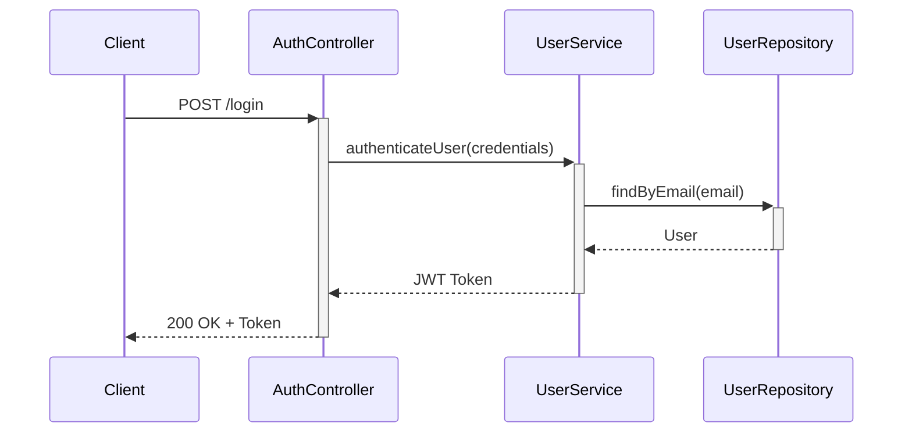
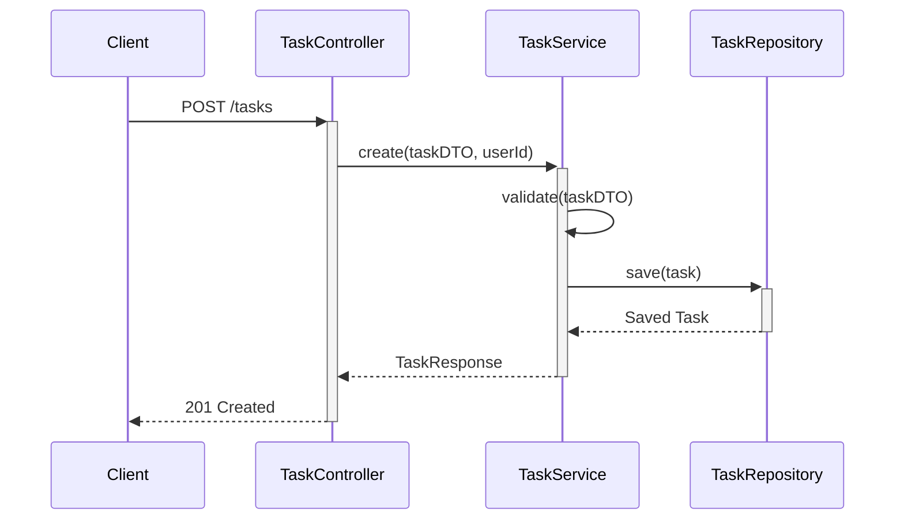

# Task Manager API - Documentation

## Project Description
Task Manager is a robust task management system designed to help users organize and track their tasks efficiently. This API provides endpoints for user authentication, task management, and task comments, following RESTful principles and modern software development practices.

## API Endpoints

### Authentication
- **POST /login**
  - **Description**: Authenticates a user and returns a JWT token
  - **Request Body**: `{ "email": "user@example.com", "password": "password123" }`
  - **Response**: JWT token for authenticated requests

### Users
- **POST /users**
  - **Description**: Creates a new user
  - **Request Body**: User details (name, email, password, roles)
  - **Response**: Created user details

- **GET /users**
  - **Description**: Retrieves all users
  - **Response**: List of all users

- **GET /users/{id}**
  - **Description**: Retrieves a specific user by ID
  - **Response**: User details

### Tasks
- **POST /tasks**
  - **Description**: Creates a new task
  - **Headers**: Authorization: Bearer {token}
  - **Request Body**: Task details (title, description, status, dueDate)
  - **Response**: Created task details

- **GET /tasks**
  - **Description**: Retrieves all tasks for the authenticated user
  - **Headers**: Authorization: Bearer {token}
  - **Response**: List of user's tasks

- **GET /tasks/{id}**
  - **Description**: Retrieves a specific task by ID
  - **Headers**: Authorization: Bearer {token}
  - **Response**: Task details

### Task Comments
- **POST /tasks/comments**
  - **Description**: Adds a comment to a task
  - **Headers**: Authorization: Bearer {token}
  - **Request Body**: Comment details (taskId, comment)
  - **Response**: Created comment details

- **GET /tasks/{taskId}/comments**
  - **Description**: Retrieves all comments for a specific task
  - **Headers**: Authorization: Bearer {token}
  - **Response**: List of task comments

## Sequence Diagrams

### User Authentication

### Task Creation

## Architecture and Design Evaluation

### Object-Oriented Principles
- **Encapsulation**: Well-implemented with private fields and public getters/setters in entities
- **Inheritance**: Limited usage, could be extended for different task types
- **Polymorphism**: Used in service interfaces and their implementations
- **Abstraction**: Clear separation between interfaces and implementations

### SOLID Principles
1. **Single Responsibility**: Each class has a single responsibility (controllers handle HTTP, services handle business logic)
2. **Open/Closed**: Open for extension but closed for modification
3. **Liskov Substitution**: Properly implemented with inheritance hierarchies
4. **Interface Segregation**: Small, focused interfaces
5. **Dependency Inversion**: Dependencies are injected through constructors

### Clean Architecture
- **Entities**: Core business objects (Task, User, TaskComment)
- **Use Cases**: Implemented in service layer
- **Interface Adapters**: Controllers and repositories
- **Frameworks & Drivers**: Spring Boot, JPA, H2 database

## Improvement Proposals

1. **Testing**
   - Add unit tests for services and controllers
   - Implement integration tests for API endpoints
   - Add test coverage reporting

2. **Documentation**
   - Add Swagger/OpenAPI documentation
   - Include more detailed API documentation with examples
   - Add request/response examples

3. **Security Enhancements**
   - Implement rate limiting
   - Add password strength validation
   - Implement refresh token mechanism

4. **Performance**
   - Add pagination for task lists
   - Implement caching for frequently accessed data
   - Optimize database queries

5. **Features**
   - Add task categories and tags
   - Implement task priorities
   - Add due date reminders
   - Support for file attachments
   - Task sharing between users

## Project Information

**Author**: [Your Name]
**GitHub Repository**: [Your Repository URL]
