# Documentação de Casos de Uso - Gerenciador de Tarefas

Este documento descreve os principais casos de uso implementados na aplicação web de gerenciamento de tarefas.

## 1. Autenticação de Usuário

### 1.1. Cadastro (Signup)

Um novo usuário pode criar uma conta para acessar a aplicação.

**Fluxo Principal:**
1. O usuário acessa a página de cadastro.
2. O usuário preenche o formulário com nome, email e senha.
3. O usuário confirma a senha.
4. O usuário clica no botão "Cadastrar".
5. O sistema valida os dados.
6. Se os dados forem válidos e o email não estiver em uso, o sistema cria o novo usuário no backend.
7. O usuário é redirecionado para a página da lista de tarefas (Task List Page).

**Fluxos Alternativos:**
*   Senha e confirmação de senha não coincidem: O sistema exibe uma mensagem de erro.
*   Email já cadastrado: O sistema exibe uma mensagem de erro.
*   Campos obrigatórios não preenchidos: O sistema exibe mensagens de validação nos campos.

**Diagrama Caso de Uso**
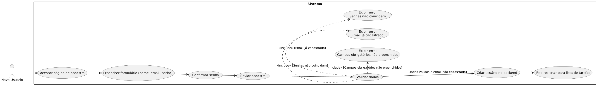

### 1.2. Login (Signin)

Um usuário registrado pode fazer login para acessar a aplicação.

**Fluxo Principal:**
1. O usuário acessa a página de login.
2. O usuário preenche o formulário com email e senha.
3. O usuário clica no botão "Login".
4. O sistema envia as credenciais para o backend.
5. O backend valida as credenciais.
6. Se as credenciais forem válidas, o backend retorna um token de autenticação.
7. O frontend armazena o token (por exemplo, em `localStorage`).
8. O usuário é redirecionado para a página da lista de tarefas (TaskList Page).

**Fluxos Alternativos:**
*   Email ou senha inválidos: O sistema exibe uma mensagem de erro.
*   Campos obrigatórios não preenchidos: O sistema exibe mensagens de validação nos campos.

**Diagrama Caso de Uso**
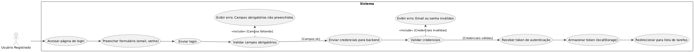

## 2. Gerenciamento de Tarefas

### 2.1. Criação de Tarefa

Um usuário autenticado pode criar uma nova tarefa.

**Fluxo Principal:**
1. O usuário autenticado acessa a página da lista de tarefas.
2. O usuário clica no botão "Criar Tarefa".
3. O usuário é redirecionado para a página de criação de tarefa.
4. O usuário preenche o formulário com título, descrição, prazo (opcional) e prioridade (opcional - padrão Normal).
5. O usuário clica no botão "Criar Tarefa".
6. O sistema valida os dados.
7. Se os dados forem válidos, o sistema envia os dados da nova tarefa para o backend.
8. O backend cria a tarefa.
9. O usuário é redirecionado de volta para a página da lista de tarefas, que exibe a nova tarefa.

**Fluxos Alternativos:**
*   Campos obrigatórios não preenchidos: O sistema exibe mensagens de validação.
*   Erro na comunicação com o backend: O sistema exibe uma mensagem de erro.

**Diagrama Caso de Uso**
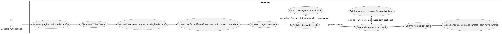

### 2.2. Visualização da Lista de Tarefas

Um usuário autenticado pode visualizar todas as tarefas em um formato de quadro (Kanban).

**Fluxo Principal:**
1. O usuário autenticado acessa a página da lista de tarefas.
2. O sistema busca as tarefas no backend.
3. O sistema exibe as tarefas organizadas por status (Backlog, To Do, In Progress, Done).
4. Cada tarefa é exibida como um card com informações básicas (Título, ID, Status).

**Fluxos Alternativos:**
*   Não há tarefas: O sistema exibe uma mensagem indicando que não há tarefas.
*   Erro na comunicação com o backend: O sistema exibe uma mensagem de erro.

**Diagrama Caso de Uso**
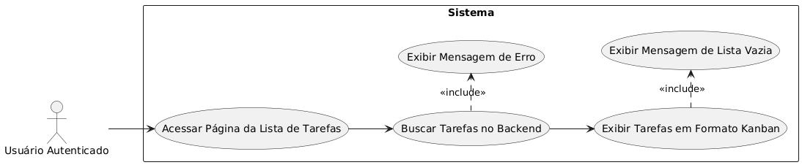

### 2.3. Visualização de Detalhes da Tarefa

Um usuário pode expandir um card de tarefa para ver detalhes adicionais.

**Fluxo Principal:**
1. Na página da lista de tarefas, o usuário clica em um card de tarefa.
2. O card se expande para exibir detalhes como Descrição, Data de Criação, Prazo e Prioridade.
3. O sistema busca os detalhes completos da tarefa no backend se necessário.

**Fluxos Alternativos:**
*   Erro ao buscar detalhes: O sistema exibe uma mensagem de erro na área de detalhes expandida.

**Diagrama Caso de Uso**
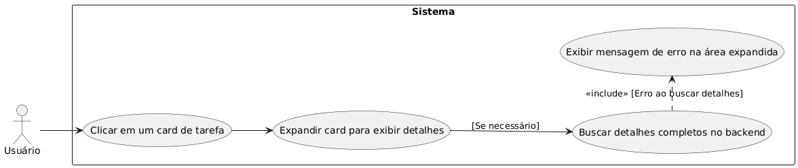

### 2.4. Edição de Tarefa

Um usuário pode editar uma tarefa existente.

**Fluxo Principal:**
1. Na página da lista de tarefas, o usuário clica no ícone de edição (lápis) no card expandido.
2. O usuário é redirecionado para a página de edição de tarefa, com os campos preenchidos com os dados atuais da tarefa.
3. O usuário modifica os campos desejados.
4. O usuário clica no botão "Atualizar Tarefa".
5. O sistema valida os dados.
6. Se os dados forem válidos, o sistema envia os dados atualizados para o backend.
7. O backend atualiza a tarefa.
8. O usuário é redirecionado de volta para a página da lista de tarefas.

**Fluxos Alternativos:**
*   Campos obrigatórios não preenchidos: O sistema exibe mensagens de validação.
*   Erro na comunicação com o backend: O sistema exibe uma mensagem de erro.

**Diagrama Caso de Uso**
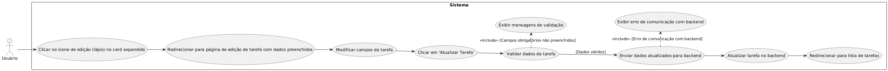

### 2.5. Exclusão de Tarefa

Um usuário pode excluir uma tarefa existente.

**Fluxo Principal:**
1. Na página da lista de tarefas, o usuário clica no ícone de exclusão (lixeira) no card expandido.
2. O sistema pede confirmação ao usuário.
3. Se o usuário confirmar, o sistema envia a requisição de exclusão para o backend.
4. O backend remove a tarefa.
5. O sistema remove o card da tarefa da lista.

**Fluxos Alternativos:**
*   Usuário cancela a exclusão: A tarefa não é removida.
*   Erro na comunicação com o backend: O sistema exibe uma mensagem de erro.

**Diagrama Caso de Uso**
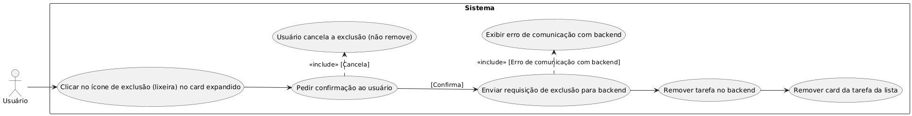

### 2.6. Alteração de Status (Dropdown)

Um usuário pode alterar o status de uma tarefa selecionando uma opção em um dropdown no card expandido.

**Fluxo Principal:**
1. Na página da lista de tarefas, o usuário clica em um card de tarefa para expandi-lo.
2. Na seção de detalhes expandida, o usuário localiza o campo de Status com um dropdown.
3. O usuário clica no dropdown e seleciona o novo status desejado (Backlog, To Do, In Progress, Done).
4. O sistema atualiza visualmente o status no card.
5. O sistema envia a requisição de atualização de status para o backend com o novo status.
6. O backend atualiza o status da tarefa no banco de dados.
7. A lista de tarefas pode ser atualizada para refletir a mudança na coluna correspondente.

**Fluxos Alternativos:**
*   Erro na comunicação com o backend: O sistema pode reverter a alteração visual do card ou exibir uma mensagem de erro.

**Diagrama Caso de Uso**
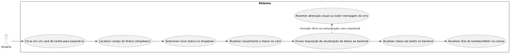

### 2.7. Filtragem de Tarefas

Um usuário pode filtrar a lista de tarefas por um campo específico.

**Fluxo Principal:**
1. Na página da lista de tarefas, o usuário seleciona um campo para filtrar (e.g., ID, Título, Status).
2. O usuário digita um valor para o filtro.
3. O sistema envia a requisição de busca filtrada para o backend.
4. O backend retorna as tarefas que correspondem ao filtro.
5. O sistema exibe a lista filtrada de tarefas.

**Fluxos Alternativos:**
*   Nenhuma tarefa encontrada: O sistema exibe uma mensagem indicando que nenhum resultado foi encontrado.
*   Erro na comunicação com o backend: O sistema exibe uma mensagem de erro.

**Diagrama Caso de Uso**
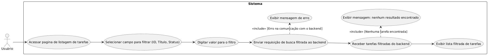

## 3. Comentários

### 3.1. Visualização de Comentários

Um usuário pode visualizar os comentários associados a uma tarefa específica.

**Fluxo Principal:**
1. Na página da lista de tarefas, o usuário expande um card de tarefa.
2. O usuário clica no ícone de comentários.
3. O usuário é redirecionado para a página de comentários da tarefa.
4. O sistema busca os detalhes da tarefa e a lista de comentários no backend.
5. O sistema exibe os detalhes da tarefa e uma lista dos comentários existentes, mostrando autor, data e conteúdo de cada comentário.

**Fluxos Alternativos:**
*   Tarefa não encontrada: O sistema exibe uma mensagem de erro.
*   Nenhum comentário existente: O sistema exibe a seção de comentários vazia com o formulário para adicionar um novo.
*   Erro na comunicação com o backend: O sistema exibe uma mensagem de erro.

**Diagrama Caso de Uso**
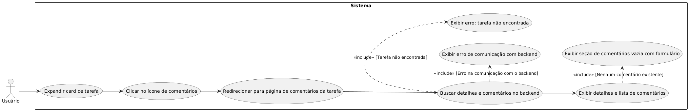

### 3.2. Adição de Comentários

Um usuário pode adicionar um novo comentário a uma tarefa.

**Fluxo Principal:**
1. Na página de comentários de uma tarefa, o usuário preenche o campo de texto para o novo comentário.
2. O usuário clica no botão "Enviar Comentário".
3. O sistema valida o campo (não pode ser vazio).
4. Se válido, o sistema envia o conteúdo do comentário e o ID da tarefa para o backend.
5. O backend cria o novo comentário associado à tarefa, registrando o autor (usuário autenticado) e a data/hora.
6. Após a criação bem-sucedida, o sistema busca e atualiza a lista de comentários exibida na página.
7. O campo de texto do formulário é limpo.

**Fluxos Alternativos:**
*   Campo de comentário vazio: O botão de enviar pode estar desabilitado ou o sistema exibe uma mensagem de validação.
*   Erro na comunicação com o backend: O sistema exibe uma mensagem de erro. 

**Diagrama Caso de Uso**
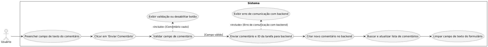