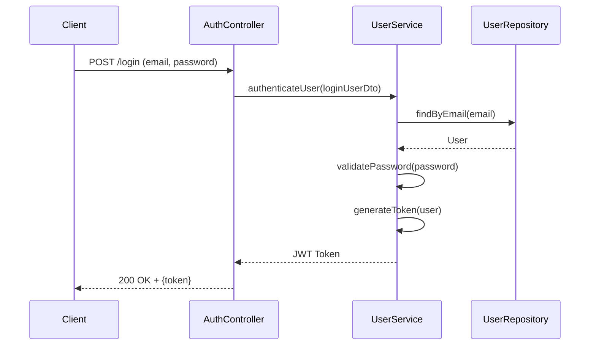
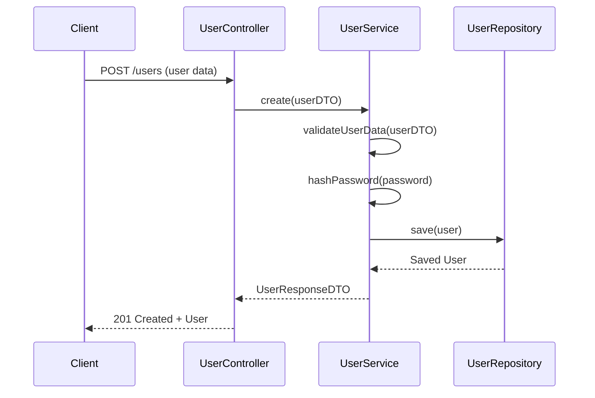
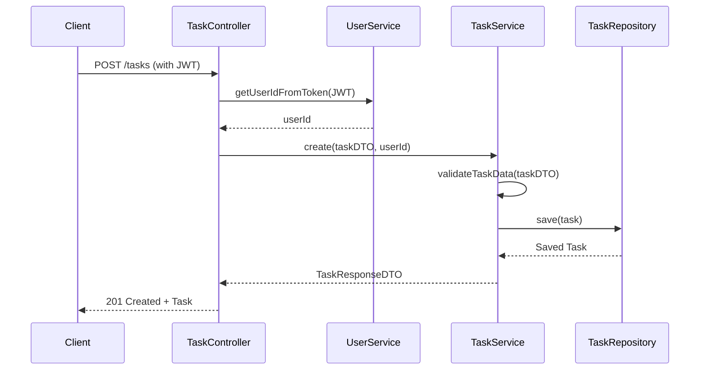
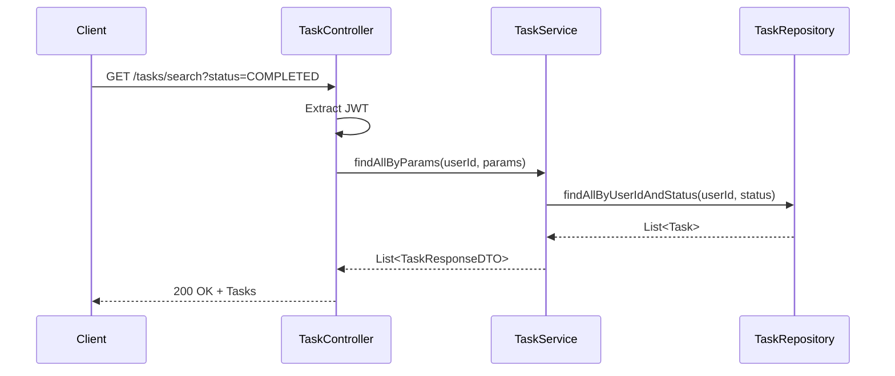
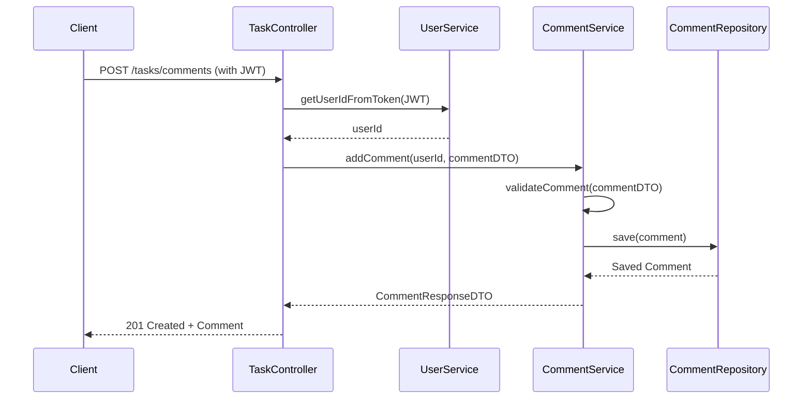

# Task Manager API - Documentation

## Project Description
Task Manager is a robust task management system designed to help users organize and track their tasks efficiently. This API provides endpoints for user authentication, task management, and task comments, following RESTful principles and modern software development practices.

## API Endpoints

### Authentication
- **POST /login**
  - **Description**: Authenticates a user and returns a JWT token
  - **Request Body**:
    ```json
    {
      "email": "usuario@exemplo.com",
      "password": "senha123"
    }
    ```
  - **Response (200 OK)**:
    ```json
    {
      "token": "eyJhbGciOiJIUzI1NiIsInR5cCI6IkpXVCJ9..."
    }
    ```

- **GET /login/test**
  - **Description**: Test authentication endpoint
  - **Headers**: `Authorization: Bearer <token>`
  - **Response (200 OK)**:
    ```
    "Autenticado com sucesso"
    ```

- **GET /login/test/customer**
  - **Description**: Test endpoint for regular users
  - **Headers**: `Authorization: Bearer <token>`
  - **Response (200 OK)**:
    ```
    "Cliente autenticado com sucesso"
    ```

- **GET /login/test/administrator**
  - **Description**: Test endpoint for administrators
  - **Headers**: `Authorization: Bearer <token>`
  - **Response (200 OK)**:
    ```
    "Administrador autenticado com sucesso"
    ```

### Users
- **POST /users**
  - **Description**: Creates a new user
  - **Request Body**:
    ```json
    {
      "name": "Novo Usuário",
      "email": "novo@exemplo.com",
      "password": "senha123"
    }
    ```
  - **Response (200 OK)**:
    ```json
    {
      "id": "123e4567-e89b-12d3-a456-426614174000",
      "name": "Novo Usuário",
      "email": "novo@exemplo.com",
      "createdAt": "2023-01-01T12:00:00Z"
    }
    ```

- **GET /users**
  - **Description**: Retrieves all users (admin only)
  - **Response (200 OK)**:
    ```json
    [
      {
        "id": "123e4567-e89b-12d3-a456-426614174000",
        "name": "Usuário 1"
      },
      {
        "id": "223e4567-e89b-12d3-a456-426614174000",
        "name": "Usuário 2"
      }
    ]
    ```

- **GET /users/{id}**
  - **Description**: Retrieves a specific user by ID
  - **Response (200 OK)**:
    ```json
    {
      "id": "123e4567-e89b-12d3-a456-426614174000",
      "name": "Usuário 1",
      "email": "usuario1@exemplo.com",
      "createdAt": "2023-01-01T12:00:00Z"
    }
    ```

- **PUT /users/{id}**
  - **Description**: Updates a user's information
  - **Request Body**:
    ```json
    {
      "name": "Nome Atualizado",
      "email": "atualizado@exemplo.com"
    }
    ```
  - **Response (200 OK)**:
    ```json
    {
      "id": "123e4567-e89b-12d3-a456-426614174000",
      "name": "Nome Atualizado",
      "email": "atualizado@exemplo.com",
      "createdAt": "2023-01-01T12:00:00Z"
    }
    ```

- **DELETE /users/{id}**
  - **Description**: Deletes a user (admin only)
  - **Response**: 204 No Content

### Tasks
- **POST /tasks**
  - **Description**: Creates a new task
  - **Headers**: `Authorization: Bearer <token>`
  - **Request Body**:
    ```json
    {
      "title": "Nova Tarefa",
      "description": "Descrição detalhada da tarefa",
      "dueDate": "2023-12-31T23:59:59Z"
    }
    ```
  - **Response (200 OK)**:
    ```json
    {
      "id": "323e4567-e89b-12d3-a456-426614174000",
      "title": "Nova Tarefa",
      "description": "Descrição detalhada da tarefa",
      "status": "PENDING",
      "user_id": "123e4567-e89b-12d3-a456-426614174000",
      "due_date": "2023-12-31T23:59:59Z",
      "created_at": "2023-01-01T12:00:00Z"
    }
    ```

- **GET /tasks**
  - **Description**: Retrieves all tasks for the authenticated user
  - **Headers**: `Authorization: Bearer <token>`
  - **Response (200 OK)**:
    ```json
    [
      {
        "id": "323e4567-e89b-12d3-a456-426614174000",
        "title": "Tarefa 1",
        "status": "PENDING"
      },
      {
        "id": "423e4567-e89b-12d3-a456-426614174000",
        "title": "Tarefa 2",
        "status": "COMPLETED"
      }
    ]
    ```

- **GET /tasks/{taskId}**
  - **Description**: Retrieves a specific task by ID
  - **Headers**: `Authorization: Bearer <token>`
  - **Response (200 OK)**:
    ```json
    {
      "id": "323e4567-e89b-12d3-a456-426614174000",
      "title": "Tarefa Detalhada",
      "description": "Descrição detalhada da tarefa",
      "status": "IN_PROGRESS",
      "user_id": "123e4567-e89b-12d3-a456-426614174000",
      "due_date": "2023-12-31T23:59:59Z",
      "created_at": "2023-01-01T12:00:00Z"
    }
    ```

- **PUT /tasks/{taskId}**
  - **Description**: Updates a task
  - **Headers**: `Authorization: Bearer <token>`
  - **Request Body**:
    ```json
    {
      "title": "Título Atualizado",
      "description": "Descrição atualizada",
      "status": "COMPLETED",
      "dueDate": "2023-12-31T23:59:59Z"
    }
    ```
  - **Response (200 OK)**:
    ```json
    {
      "id": "323e4567-e89b-12d3-a456-426614174000",
      "title": "Título Atualizado",
      "description": "Descrição atualizada",
      "status": "COMPLETED",
      "user_id": "123e4567-e89b-12d3-a456-426614174000",
      "due_date": "2023-12-31T23:59:59Z",
      "created_at": "2023-01-01T12:00:00Z"
    }
    ```

- **DELETE /tasks/{taskId}**
  - **Description**: Deletes a task
  - **Headers**: `Authorization: Bearer <token>`
  - **Response**: 204 No Content

- **GET /tasks/search**
  - **Description**: Searches tasks with filters
  - **Headers**: `Authorization: Bearer <token>`
  - **Query Parameters**:
    - `status`: Filter by status (e.g., `PENDING`, `IN_PROGRESS`, `COMPLETED`)
    - `title`: Filter by title containing the given text
    - `description`: Filter by description containing the given text
  - **Example Request**: `GET /tasks/search?status=COMPLETED&title=urgente`
  - **Response (200 OK)**:
    ```json
    [
      {
        "id": "523e4567-e89b-12d3-a456-426614174000",
        "title": "Tarefa Urgente",
        "status": "COMPLETED"
      }
    ]
    ```

### Task Comments
- **POST /tasks/comments**
  - **Description**: Adds a comment to a task
  - **Headers**: `Authorization: Bearer <token>`
  - **Request Body**:
    ```json
    {
      "taskId": "323e4567-e89b-12d3-a456-426614174000",
      "comment": "Este é um comentário importante sobre a tarefa."
    }
    ```
  - **Response (201 Created)**:
    ```json
    {
      "id": "723e4567-e89b-12d3-a456-426614174000",
      "comment": "Este é um comentário importante sobre a tarefa.",
      "userName": "Usuário 1",
      "createdAt": "2023-01-01T14:30:00Z"
    }
    ```

- **GET /tasks/{taskId}/comments**
  - **Description**: Retrieves all comments for a specific task
  - **Headers**: `Authorization: Bearer <token>`
  - **Response (200 OK)**:
    ```json
    [
      {
        "id": "723e4567-e89b-12d3-a456-426614174000",
        "comment": "Primeiro comentário sobre a tarefa.",
        "userName": "Usuário 1",
        "createdAt": "2023-01-01T14:30:00Z"
      },
      {
        "id": "823e4567-e89b-12d3-a456-426614174000",
        "comment": "Segundo comentário com atualizações.",
        "userName": "Usuário 2",
        "createdAt": "2023-01-01T15:45:00Z"
      }
    ]
    ```

## Sequence Diagrams

### 1. User Authentication


### 2. User Registration


### 3. Task Creation


### 4. Task Search


### 5. Adding Task Comment


## Architecture and Design Evaluation

### Object-Oriented Principles
- **Encapsulation**: Well-implemented with private fields and public getters/setters in entities
- **Inheritance**: Limited usage, could be extended for different task types
- **Polymorphism**: Used in service interfaces and their implementations
- **Abstraction**: Clear separation between interfaces and implementations

### SOLID Principles
1. **Single Responsibility**: Each class has a single responsibility (controllers handle HTTP, services handle business logic)
2. **Open/Closed**: Open for extension but closed for modification
3. **Liskov Substitution**: Properly implemented with inheritance hierarchies
4. **Interface Segregation**: Small, focused interfaces
5. **Dependency Inversion**: Dependencies are injected through constructors

### Clean Architecture
- **Entities**: Core business objects (Task, User, TaskComment)
- **Use Cases**: Implemented in service layer
- **Interface Adapters**: Controllers and repositories
- **Frameworks & Drivers**: Spring Boot, JPA, H2 database

## Improvement Proposals

1. **Testing**
   - Add unit tests for services and controllers
   - Implement integration tests for API endpoints
   - Add test coverage reporting

2. **Documentation**
   - Add Swagger/OpenAPI documentation
   - Include more detailed API documentation with examples
   - Add request/response examples

3. **Security Enhancements**
   - Implement rate limiting
   - Add password strength validation
   - Implement refresh token mechanism

4. **Performance**
   - Add pagination for task lists
   - Implement caching for frequently accessed data
   - Optimize database queries

5. **Features**
   - Add task categories and tags
   - Implement task priorities
   - Add due date reminders
   - Support for file attachments
   - Task sharing between users

## Project Information

**Author**: [Your Name]
**GitHub Repository**: [Your Repository URL]
